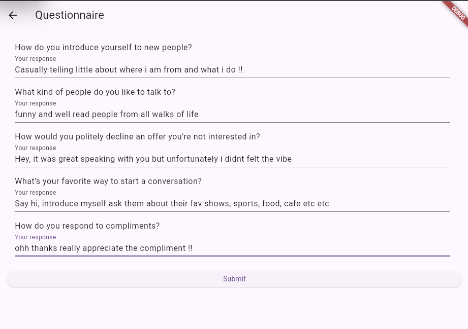
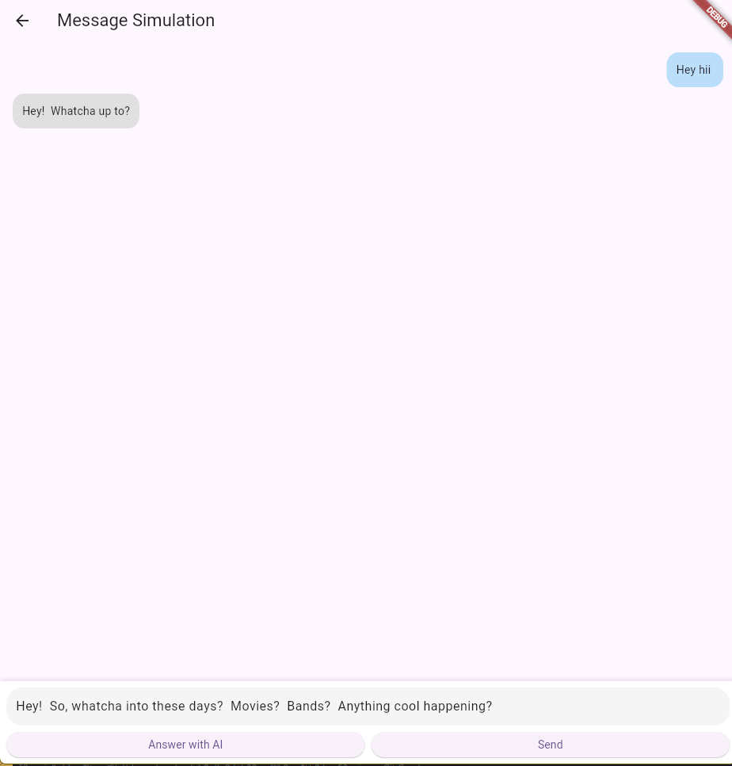
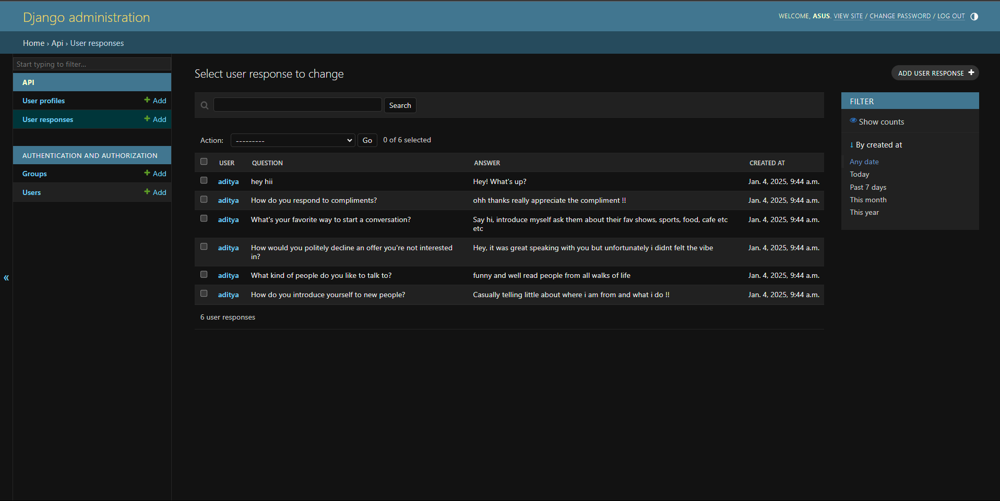

# UM-AI-BOT

## Backend

```sh
cd Backend
```

```sh
pip install -r requirements.txt
```

```sh
cp .env.example .env
```

```sh
python manage.py runserver
```

## Frontend

```sh
flutter pub get
```

```sh
flutter run
```

## Output






### License

This project is licensed under the MIT License.
